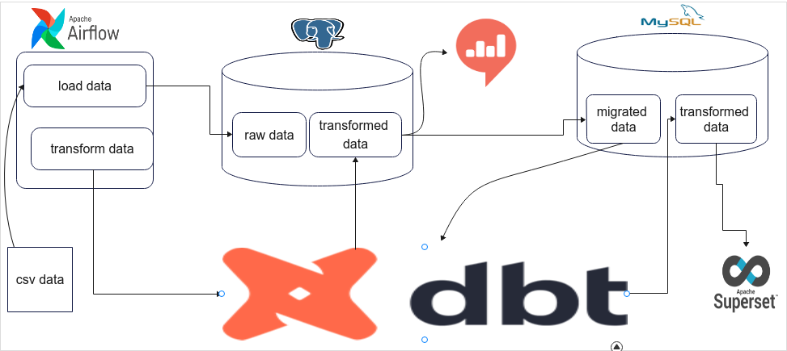

# Data-Warehouse-techstack-migration

**Table of content**

[Data-Warehouse-techstack-migration](#Data-Warehouse-techstack-migration)

- [Introduction](#Introduction)
- [Included Technologies and tools](#Included-Technologies-and-tools)
- [Dev setup](#Dev-setup)
- [Root folder](#Root-folder)
- [Project Structure](#project-structure)
  - [airflow](#airflow)
  - [data](#data)
  - [dbt](#dbt)
  - [images](#images)
  - [notebooks](#notebooks)

## Introduction

We Had Built an ELT Framework using Postgres , DBT , Redash In previous project using traffic data. well On this project we are going to migrate the database to MYSQL and change Redash to Apache Superset. This project will help in understanding and implementing changes and automations in the day to day life of a data engineering.

## Included-Technologies-and-tools

Apache Airflow - A workflow manager to schedule, orchestrate & monitor workflows. Directed acyclic graphs (DAG) are used by Airflow to control workflow orchestration.

Mysql - is an Oracle-backed open source relational database management system (RDBMS) based on Structured Query Language (SQL)

DBT (data build tool) - enables transforming data in warehouses by simply writing select statements. It handles turning these select statements into tables and views.

Apache Superset - is fast, lightweight, intuitive, and loaded with options that make it easy for users of all skill sets to explore and visualize their data, from simple line charts to highly detailed geospatial charts.

## Dev-setup

  Clone this repo

      https://github.com/tesfayealex/Data-Warehouse-techstack-migration

  Install python requirements

      cd  traffic-data-pipeline-and-warehouse
      pip install -r requirements

  Install Docker , Docker compose and Redash

      ./setup.sh

  Initialize airflow with docker-compose

      docker-compose up

## Root-folder:

- `README.md`: Markdown text with a brief explanation of the project and the repository structure.
- `Dockerfile`: build users can create an automated build that executes several command-line instructions in a container.
- `setup.sh`: Docker installer for redash including docker and docker-compose installer
- `docker-compose`: Docker compose for airflow
- `requirements`: Python requirements to run the project 

## Project Structure

The Project uses a truffle unbox structure and follows

### airflow

This folder holds airflow dags and sql queries

### dbt

This folder holds queries in dbt and sql queries

### data

This folder holds data used on the project 

### images

This folder holds important images

### notebooks

This folder holds EDA notebook for visualization of the data